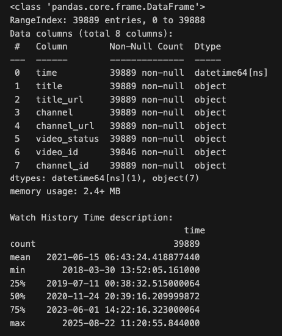
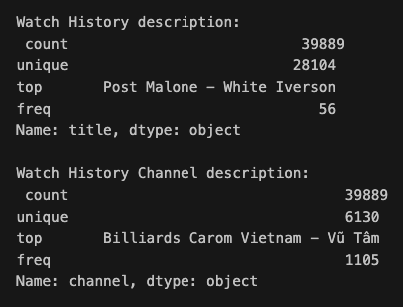
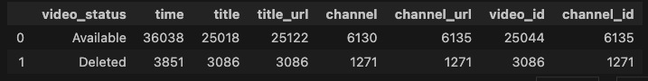

# **MY YOUTUBE STATISTICS**
 **From 2018 to 2025-08-22*
# **0. Table of contents**
- I. Import Library
- II. Prepared functions
- III. Import MY WATCH HISTORY
  - III.1. Describe MY WATCH HISTORY
  - III.2. Save MY WATCH HISTORY to a file
- IV. GET videos & channels THUMBNAIL
  - IV.1. Get VIDEOs thumbnail
    - IV.1.1. VIDEOs dataframe
    - IV.1.2. VIDEOs thumbnail dataframe
    - IV.1.3. DOWNLOAD VIDEOs thumbnail
    - IV.1.4. SAVE VIDEOs thumbnail
    - IV.1.5. IMPORT saved VIDEOs thumbnail
  - IV.2. Get CHANNELs thumbnail
    - IV.2.1. CHANNELs dataframe
    - IV.2.2. CHANNELs thumbnail dataframe
    - IV.2.3. Get CHANNELs thumbnail URL from Google API
    - IV.2.4. DOWNLOAD CHANNELs thumbnail
    - IV.2.5. SAVE CHANNELs thumbnail
    - IV.2.6. IMPORT saved CHANNELs thumbnail
- V. Merge MY WATCH HISTORY and THUMBNAIL
- VI. MY WATCH HISTORY video status
- VII. MY WATCH CHANNELs
  - VII.1. All CHANNELs
  - VII.2. TOP 20 CHANNELs
    - VII.2.1. [WORDCLOUD] TOP CHANNELs
    - VII.2.2. [TREEMAP] TOP CHANNELs
  - VII.3. CHANNELs by year
  - VII.4. CHANNELs by month
    - VII.4.1. WATCH CHANNELs by month
    - VII.4.2. TOP CHANNEL by month
    - VII.4.3 [THUMBNAIL] TOP CHANNEL by month
- VIII. MY WATCH VIDEOs
  - VIII.1. All VIDEOs
  - VIII.2. TOP 20 VIDEOs
    - VIII.2.1. [WORDCLOUD] TOP VIDEOs
    - VIII.2.2. [TREEMAP] TOP VIDEOs
  - VIII.3. VIDEOs by year
  - VIII.4. VIDEOs by month
    - VIII.4.1. WATCH VIDEOs by month
    - VIII.4.2. TOP VIDEO by month
    - VIII.4.3 [THUMBNAIL] TOP VIDEO by month
- IX. MY WATCH by hour
- THE END

### **I. Import Library**

### **II. Prepared functions**

# **III. Import MY WATCH HISTORY**

## **III.1. Describe MY WATCH HISTORY**

### **IV. GET videos & channels THUMBNAIL**

### **V. Merge MY WATCH HISTORY and THUMBNAIL**

# **VI. MY WATCH HISTORY video status**

# **VII. MY WATCH CHANNELs**
## **VII.2. TOP 20 CHANNELs**

### **VII.2.1. [WORDCLOUD] TOP CHANNELs**

### **VII.2.2. [TREEMAP] TOP CHANNELs**

## **VII.3. CHANNELs by year**

## **VII.4. CHANNELs by month**
### **VII.4.1. WATCH CHANNELs by month**

### **VII.4.2. TOP CHANNEL by month**

### **VII.4.3 [THUMBNAIL] TOP CHANNEL by month**

# **VIII. MY WATCH VIDEOs**
## **VIII.2. TOP 20 VIDEOs**

### **VIII.2.1. [WORDCLOUD] TOP VIDEOs**

### **VIII.2.2. [TREEMAP] TOP VIDEOs**

## **VIII.3. VIDEOs by year**

## **VIII.4. VIDEOs by month**
### **VIII.4.1. WATCH VIDEOs by month**

### **VIII.4.2. TOP VIDEO by month**

### **VIII.4.3 [THUMBNAIL] TOP VIDEO by month**

# **IX. MY WATCH by hour**

# **THE END**